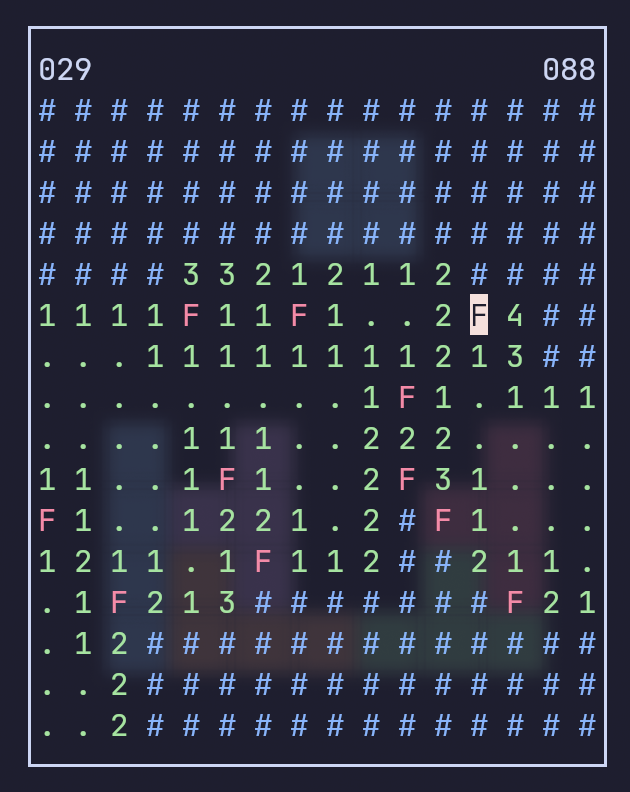

# Minesweeper TUI
A TUI Minesweeper game written in C.



Installation
```bash
# Clone the repo
git clone https://github.com/ZhaolunYin/minesweeper-tui.git && cd minesweeper-tui

# build & run
make
./minesweeper

# or
make run
```
