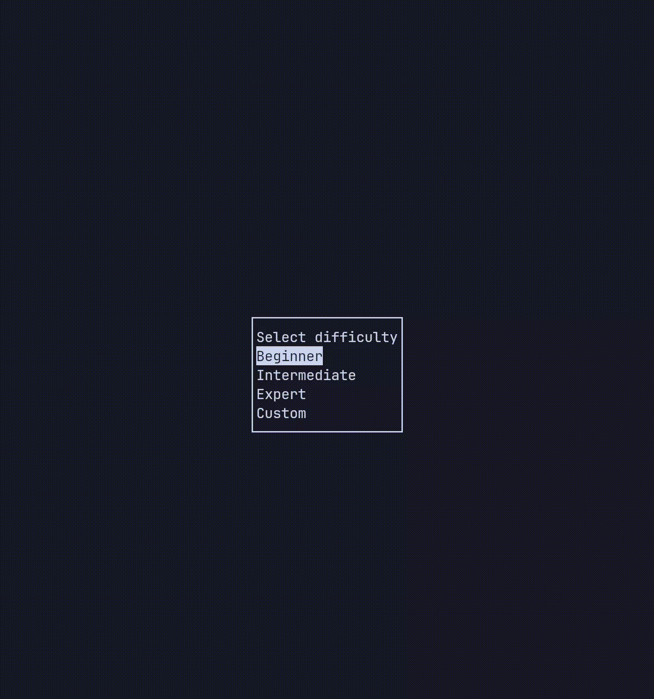

# Minesweeper TUI

[](https://github.com/ZhaolunYin/minesweeper-tui/releases)
[](https://github.com/ZhaolunYin/minesweeper-tui?tab=MIT-1-ov-file)
[](https://github.com/ZhaolunYin/minesweeper-tui)

A TUI Minesweeper game written in C.



## Installation
### Nix
If you have nix installed, you can do:
```bash
nix run github:ZhaolunYin/minesweeper-tui
```

### Dependencies
The following dependencies must be installed **before** compilation:
- **make**
- **ncurses**

### Compilation
```bash
# Clone the repo
git clone https://github.com/ZhaolunYin/minesweeper-tui.git && cd minesweeper-tui

# build & run
make
./minesweeper

# or
make run
```

## Controls
### Keyboard

| Key   | Action |
|-------|--------|
| Enter | Covered square: Uncover square |
| Enter | Uncovered square: Chord |
| Arrow / Vim keys | Move cursor |
| F | Flag square |

### Mouse

| Button | Action |
|--------|--------|
| Left   | Covered square: Uncover square |
| Left   | Uncovered square: Chord |
| Right  | Flag square |

## Chording
> Chording is a feature in minesweeper where all unflagged cells around a number can be opened when the correct amount of flags are around it.
> \- [*Minesweeper Wiki*](https://minesweeper.fandom.com/wiki/Chording)

## Difficulties

| Difficulty | Grid | Mines |
|------------|------|-------|
| Beginner | 9x9 | 10 |
| Intermediate | 16x16 | 40 |
| Expert | 30x16 | 99 |
| Custom | 4x4 - screen size | > 0 |

## Features
- Ascii text interface with mouse support
- Custom board size
- Chording
